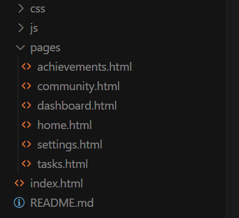

# AI 编程入门工具：一文读懂什么是 Cursor 和 MCP

PDF 版下载：

**太长不看：**

- Cursor 是一个 AI IDE，可以让你通过自然语言写代码，以及更快地理解和学习代码
- Cursor 有多种功能，agent 模式生产力非常高，是目前我重度使用的一款 AI IDE，类似产品只有 windsurf 还行，两者区别不大，选一款使用即可。
- 分步骤图文，详细讲解了 Cursor 如何安装，付费，以及供你直接体验使用的一段提示词
    - Pro版定价20美元/月，不推荐共享账号(有使用次数限制)，需要科学上网环境
- 有学习和生产需求的小伙伴，建议直接使用付费版 Cursor，不建议通过淘宝闲鱼等共享账号；需求不大可以使用免费版可以免费体验两周 Pro，体验来讲绝对够用了。
- MCP(模型上下文协议)是一种开放标准，允许AI直接与外部数据源和服务交互
- 对于不习惯和 AI 交互的小伙伴，现在最重要的是养成和 AI 对话的习惯，工具都是次要的。
- AI 发展太快，但无需焦虑，慢慢用起来就可以了，加入我的学习群一起学习，不定时解答问题。

# 什么是 Cursor？

Cursor AI 是基于 Visual Studio Code 构建的强大 AI 代码编辑器，它将大型语言模型（LLM）功能直接集成到编辑器核心界面中。 Cursor 不仅仅是一个普通编辑器，而是一个能够理解你整个代码库的智能助手，通过与 AI 模型的深度集成，实现了代码生成、优化和理解的新范式。 它的架构保留了 VS Code 的熟悉界面和性能优势，同时增加了强大的 AI 功能层，使开发者能够无缝地与人工智能协作。

Cursor 提供了多种与 AI 交互的方式，每种方式都针对不同的编程场景进行了精心优化：

1. **智能自动补齐**：Cursor 的预测式编辑功能可以预测并建议多行代码编辑，这种自动完成功能始终处于活跃状态，能够理解上下文并提供相关的代码建议。与传统自动补齐不同，Cursor 可以理解整个代码库的结构和逻辑关系，提供更加智能的补全。
2. **聊天界面**：开发者可以通过侧边栏的聊天功能直接向 AI 提问，询问有关代码实现、算法优化或错误修复的问题，AI 会基于当前代码上下文提供详细解答。这种交互方式模拟了与资深开发者结对编程的体验。
3. **代码生成与重构**：通过简单的指令提示，开发者可以要求 Cursor 生成整个类或函数，或者重构现有代码以提高其效率和可读性。Cursor 能够理解项目的编码风格和架构，生成与现有代码风格一致的新代码。
4. **Agent 模式**：这是 Cursor 的高级功能，允许 AI 执行更复杂的任务，如构建完整的应用程序组件或解决复杂的编程挑战。在 Agent 模式下，AI 可以主动提出问题、探索解决方案并执行多步骤任务。
5. **智能调试助手**：Cursor 能够分析运行时错误和异常，提供可能的原因和解决方案。它不仅指出错误，还能解释错误发生的原因和修复策略，帮助开发者更深入地理解问题。

## **实际应用案例**

- **1、快速原型开发**：开发者可以通过描述功能需求，让 Cursor 生成初始代码框架，大幅缩短原型开发时间。

**我来分享一下我是如何通过 Cursor 进行快速原型开发的，让大家直观感受下 Cursor 的强大效果。**提示词改编自 @AlchainHust，使用了 Live Server 插件用来在浏览器看原型效果。

打开 Cursor ，Agent 模式，Claude 3.7 Sonnet，输入如下提示词：

```markdown
我想开发一个基于网页的 Web3 AI 学习激励平台（类似 Duolingo 和 StepN 的理念但专为桌面浏览器设计），用户通过连接钱包登录，上传与大模型的对话分享链接获取积分，在个性化仪表盘中追踪学习进度和成就，通过游戏化元素激励用户持续与 AI 大模型互动学习。现在需要输出高保真的桌面网页原型图，请帮我完成所有界面的原型设计：

1. 用户体验分析：分析这个网页应用的主要功能和用户需求，确定核心交互逻辑。
2. 产品界面规划：定义关键界面，确保信息架构合理，采用桌面网页布局（非移动端）。
3. 高保真 UI 设计：设计符合现代网页设计规范的界面，使用宽屏布局和网页端常见的导航模式。
4. HTML 原型实现：使用 HTML + Tailwind CSS 生成所有原型界面，并使用 FontAwesome 等组件。

具体要求：
- 所有界面必须采用桌面网页布局（非移动端），响应式设计但优先考虑宽屏显示
- 标准桌面网页导航栏（顶部横向导航）
- 适合大屏幕显示的内容布局，利用充足的水平空间
- 每个界面作为独立的 HTML 文件存放
- index.html 作为主入口，使用 iframe 嵌入各页面
- 界面尺寸设置为标准桌面显示器比例（16:9），最小宽度 1280px
- 使用真实的 UI 图片，而非占位符图片

请按照以上要求生成完整的 HTML 代码，确保其符合现代桌面网页设计风格，并可用于实际开发。

```

Cursor 自动运行大概 10 分钟，所有代码都生成完毕



现在通过 Live Server 打开 index.html，看下效果：


这个效果当时发在一个学习群里面，群友们还是一致觉得效果不错的。上面只是静态效果，实际上 Cursor 给每个卡片都加了悬停效果，有些 button 还有动态效果。对于一个在  20 分钟之内完成的原型来说，可以说是相当惊艳，刚看到这个效果，我自己觉得低层次的 UI 和设计师感觉都已经失业了。这一整套原型直接直接拿到市场上卖也能卖出真金白银来。

下面是我复制花生的提示词做的移动端原型，也不错：


- **2、代码调试与优化**：Cursor 内置的错误查找功能可以分析代码中的潜在问题，并提供修复建议，有效减少调试时间。它能识别性能瓶颈、内存泄漏风险和安全漏洞，并提出改进建议。

我调试后端的时候非常有用，我的经验是让 Cursor 提前写好测试用例，每次可以自己调试，自己 debug。我会在后面的文章中详细讲解 Cursor 写后端这部分。我用 Cursor 生成的脚本很多，能够非常有效地提升

- **3、学习新框架和语言**：通过向 Cursor 询问特定语言或框架的实现方法，开发者可以更快地掌握新技术。Cursor 不仅提供代码示例，还能解释底层概念和最佳实践，加速学习曲线。

我基本上在用 AI 学习代码的时候，用一半的时间是用在 Cursor 对话上的，还有一半时间在大模型前端上，基本五五开。我会仔细浏览我想要学习的代码片段，先跟整个代码文件对话，然后再框选特定的代码片段对话。

我经常用的一段提示词是：

```markdown
请仔细分析这段代码，关于这段代码：
1. 请解释这个代码文件的整体结构和用途，简单解释这段代码的功能。主要组件有哪些，它们如何相互作用？
2. 它遵循了哪些最佳实践？
3. 有经验的开发者会如何重构它？
4. 编写此类代码时的常见陷阱有哪些？
5. 指出潜在的bug或性能问题
```

然后我会通过深入提问的方法进行进一步消化吸收，关于如何深入提问，我在之前的文章中有详细的讲解。

- **代码文档生成**：Cursor 可以自动为函数和类生成详细的文档注释，包括参数说明、返回值描述和使用示例，提高代码可维护性。

在看一些 github 公开库的时候，有些项目的代码写得不错，但是缺乏相对应的注释和详实的文档，可以直接 pull 到本地仓库用 Cursor 辅助阅读。在生产中也可以直接辅助生成文档和注释，非常方便。

## **Cursor 跟传统 IDE 比如 VS Code 相比，优势在哪？**

- **代码自动补全：**虽然 VS Code 也有很多插件来接入大模型做这个，但 Cursor 内置优化效果更好
- **自然语言交互**：支持用普通语言描述开发需求，降低复杂操作的负担，使编程更直观
- **Agent 模式：**自动创建文件，运行 terminal 指令，构建代码，省心省力，这也是我最常用的
- **深度代码理解**：利用大型语言模型理解整个项目的代码语义和意图，提供完整函数实现建议，包括错误处理和边缘情况，显著减少重复编码
- **上下文感知**：提供考虑当前任务和代码环境的动态文档，生成与现有代码集成的具体示例，减少文档切换；还可以通过 MCP 协议在编辑器内直接访问外部知识源，减少工具切换，创造统一的开发环境
- **团队协作增强**：AI 辅助生成代码文档和逻辑解释，加速新成员理解代码库，减少沟通障碍，提高团队一致性
- **个人非常喜欢的一些原生小功能**
    - **Cursor Rule：**类似 GPTs（玩过 GPTs 的都知道这个自定义 rule 有多好用），可以为每个代码库生成一个单独的自然语言定义的前置规则，用于更加精确地控制底层 LLM 的输出
    - **支持自选底层大模型：**每次都能支持最新的大模型，接入速度很快，不用担心底层模型迭代，可以根据自己的喜好选择使用，我目前最常用的就是 Claude 3.7 Sonnet。还可以配置自己的 API，这个在使用需求很高的时候非常省钱。
    - **代码间随时对话：**随时在代码中开启对话，不管是用来学习（比如框出一段代码让他解释相关原理）还是开发，都很丝滑。

# AI 编程目前的首选：Cursor 使用建议

如果是计算机相关专业，或者对编程需求较高的学生，强烈建议现在马上立刻用 Cursor 进行学习和开发，这将大大提升你的学习效率，这是我实践过的。

如果是开发者，我的建议是，如果你对 AI 编程感到不信任暂时放下对 AI 的各种偏见和想法，先用起来，一开始可能会感到不适，甚至效率下降，但习惯之后绝对会有巨大的效率提升。

所有对 AI 学习感兴趣的人都建议使用 Cursor 来入门编程，因为编程是反馈非常快的，可以很好地进行学讲练循环。

**关于是否要付费**

目前 Pro 版定价 20 美元/月，折合人民币大概 145 元左右，在国内的视角来看定价还是有点贵的，不过相信我，只要你能用起来，就绝对值这个价钱。年付是 16 美元/月。如果拿不准要不要付费长期使用，免费版目前可以免费使用 Pro 两周。两周的时间足够你体验 Cursor 所有的功能了。

不推荐淘bao等购买共享账号，因为 Cursor 请求是有次数限制的，超过之后速度会变慢，并且有降智的现象。

注意，Cursor 刚需科学上网环境。国内 AI IDE 目前并没有性能和体验相匹配的平替版本。

# 如何安装 Cursor，如何付费，分步图文教学

先进入 Cursor 官网，[https://www.cursor.com/cn](https://www.cursor.com/cn)，根据自己的操作系统下载对应版本。


下载完成后点击安装包安装即可。


### 付费

先创建账号登录，邮箱地址即可


然后付款我们需要一张 Visa 卡，国内的话像招行的 visa 全币种信用卡是支持的。淘宝代充没有测试过，不推荐，请谨慎选择。


# 什么是**模型上下文协议（MCP）？**

模型上下文协议（Model Context Protocol，MCP）是一个开放标准，旨在建立 AI 模型与外部数据源之间的安全、双向连接。**简单来讲就是重新设立一种大模型和应用、服务等交互的标准。**

我举个场景帮助大家理解，没有 MCP 之前，我跟大模型对话，我让他帮我订机票，他只会根据我的需求去得出一个比较好的方案或者建议，但是最终操作下单等都是我自己在订机票的软件上执行的，这是半自动化。

再比如，没有MCP时，AI 只能推荐产品，比较分析，我还需要自己操作去下单；有了 MCP 后，你可以直接说"帮我买一双42码的黑色 Nike 跑鞋"，AI可以直接连接电商平台，查询库存、比较价格，甚至完成下单和支付流程。

再举一个复杂的场景，浏览器模拟是当下很多场景下会用到的，主要就是大模型很难直接操作浏览器，我们就让大模型帮我们写浏览器模拟的脚本，模拟浏览器操作，尤其是登录验证等场景。这属于绕了一圈，增加了开发成本和难度。如果有支持浏览器的 MCP，那么浏览器模拟这一步就可以省去。

简单理解的话就是 MCP 赋予大模型直接操作应用程序的能力，这不太严谨，但方便理解。也就是说我们基于 MCP 的框架，可以开放更多的服务让大模型直接调用。这是构建智能体的一种路径和框架，也是我用的最多的。

## MCP 架构分析

MCP 是一种架构，它定义了一种通信规则和标准。最核心的可以理解就是客户端和服务端。MCP 的架构包括以下核心组件：

1. **MCP Hosts (主机程序)**：
    - 例如 Claude 桌面应用、各种 IDE、AI 工具。
    - 这些程序希望通过 MCP 来访问数据和功能。
    - Cursor 就是一个主机程序
2. **MCP Clients (客户端)**：
    - MCP 客户端程序与 MCP 服务器保持一对一连接。
    - 客户端负责发起请求，调用服务器提供的资源、工具和提示模板。
    - 简单理解就是 Cursor 内置了一个支持 MCP 的客户端
3. **MCP Servers (服务器)**：
    - 轻量级程序，暴露特定功能（资源、工具、提示）给客户端。
    - 提供统一标准的 MCP 接口，客户端通过该接口与服务器交互。
4. **Local Data Sources (本地数据源)**：
    - 本地文件、数据库或服务。
    - MCP 服务器可安全地访问这些数据源，向客户端提供数据。
5. **Remote Services (远程服务)**：
    - 通过互联网可访问的外部系统（如 Web API）。
    - MCP 服务器连接到这些服务，获取外部数据提供给客户端。


## **Server 是干什么的？Server 的开发者能开发什么？**

### MCP Server 的作用：

MCP Server 是 MCP 架构中的关键组件，专门负责：

- **向 MCP 客户端暴露特定功能**（数据访问、工具调用、提示模板）。
- **管理与本地数据源或远程服务的连接**，并以标准化的方式提供数据和功能给客户端。

### MCP Server 提供的主要能力：

根据官方文档，MCP Server 提供三种主要能力：


Cursor 目前支持 Tools 调用。Claude Desktop 支持三种类型的能力全调用。

**作为 MCP Server 的开发者，你可以开发：**

- **数据服务**：
    - 实现文件系统访问服务（如本地文件系统、Google Drive）。
    - 实现数据库访问服务（如 PostgreSQL、SQLite）。
- **工具服务**：
    - 提供特定功能的 API，例如数据分析、自然语言处理工具。
    - 提供外部服务集成，例如调用第三方 API。
- **提示模板服务**：
    - 提供特定任务的预设模板，帮助用户快速完成任务。

也就是说，MCP 想要推广成一种通用标准，关键就在于有没有足够多的团队或者厂商原意开发相应的 MCP Server。从生态的角度来理解，就像是 IOS 系统需要有很多人来开发 IOS 软件，否则苹果手机不会有人用。

**为了进一步方便理解，我还是举之前的订机票例子，Server 体现在：**

- 你跟大模型说：“帮我订明天飞往上海的机票”。
- 此时，MCP Server 体现为一个专门连接机票预订服务的平台服务端。
    - Server 负责连接真实的机票预订系统（例如携程、飞猪、航空公司官网）。
    - Server 提供工具接口（Tools），允许客户端（大模型）直接调用：
        - 查询航班信息（资源访问）。
        - 确认座位库存（工具调用）。
        - 完成下单支付（工具调用）。
- 大模型通过 MCP Client 调用 MCP Server 提供的工具，直接完成订票动作。

也就是说，这个场景里 Server 就是那个负责真正去航空公司或OTA平台上查询、下单、支付的“中间人”。

## **Client 是干什么的？Client 开发者能开发什么？**

### MCP Client 的作用：

MCP Client 是宿主程序内部的组件，负责：

- 与 MCP Server 建立连接。
- 调用 MCP Server 提供的资源、工具或提示模板。
- 将 MCP Server 提供的数据或功能整合到宿主程序中，提供给用户使用

### Client 开发者可以开发什么？

作为 MCP Client 的开发者，你可以开发：

- **宿主应用程序的扩展功能**：
    - 在 IDE 中集成代码自动补全、代码生成的工具。
    - 在 AI 工具中集成数据分析、文件搜索功能。
- **数据和工具的访问接口**：
    - 提供简洁的 UI，让用户方便地调用 MCP Server 提供的功能。
- **自动化工作流**：
    - 利用 MCP Server 提供的资源和工具，构建自动化任务。

# 实测比较好用的 MCP

我自己本身也在学习 AI 编程，MCP 使用过一些，但比较局限于我自己正在开发的功能或当下比较急迫的需求，并没有详细评测过 MCP。下面这两个网站收集了很多 MCP，并附带简介，有需要进一步深入研究的可以去这两个网站：

https://cursor.directory/mcp

https://portkey.ai/mcp-servers

我自己常用，实测好用的是 Figma MCP，支持 Cursor 无损读取 Figma 文件，更好地进行代码开发。

[https://cursor.directory/mcp/figma](https://cursor.directory/mcp/figma)

我会在后面尝试使用 K8s，SQL 这些 MCP，使用完之后再分享实测体验。

## 一些实战小技巧

- Cursor Directory Curate 了很多学习资源以及已经定义好的 Cursor Rule，可以根据自己的技术栈选择：[https://cursor.directory/rules](https://cursor.directory/rules)
- Cursor 支持 VS 插件，很多功能都可以通过安装插件来补齐，我常用的有 Github，SSH，Live Server，WSL 等
- 北京时间的下午使用 Cursor 会更流畅，速度更快，晚上使用可能会出现断连情况
- 使用学讲练循环的技巧可以帮助你解决大部分代码，操作和部署上的问题
- 初次进行 AI 编程的实践，可能需要安装大量编程环境相关的软件等，比较繁琐，请耐下性子慢慢做。

## 保持合理想象 — Cursor + MCP 不好做什么？

本文不是贩卖焦虑的，所以不会告诉你不用 Cursor + MCP 就会失业。我会明确告诉你，不用 Cursor + MCP + AI 学习方法的话，你的学习和进步速度要慢很多，但是想用到开发环境上，还需要在编程上下很大功夫和学习很长时间才能真正开发，但 AI 已经答复缩减了你可以成为一个独立开发者的时间。

AI 在前端原型设计方面确实表现出色。它能够快速生成框架，这对开发流程的意义重大 —— **不是说生成的代码可以直接用于生产环境，而是在原型设计阶段带来了革命性的效率提升。当 AI 能在短时间内生成可视化原型时，确定产品的交互和 UI 设计的过程被大幅压缩。**

对有实际项目经验的开发者来说，这意味着什么？**你可以在一个工作日内审核和修改十多个设计方案，完善各种功能界面。因为从创意构思到完整原型的时间缩短到了惊人的 20 分钟左右。这种效率在传统开发流程中是不可想象的。**

然而，认为 AI 能在当前阶段完整地构建前后端一体的系统是过于乐观的。Devin 等工具尝试通过 AI 工作流实现这一目标，但实践已经证明这一方案尚不成熟，特别是在后端开发领域。

后端开发与前端原型搭建有本质区别：

- 需要**完整且连贯的系统一致性**，包括数据模型、表设计、业务流程和接口定义
- 要求严格的**安全性**考量
- 必须能够**承载大量数据和用户请求**
- 涉及复杂的 **DevOps 和运维**工作
- 遵循严格的**环境部署流程**（测试环境→生产环境）
- 需要持续的**测试、调试和 debug**

这些特性决定了以当前大模型的能力水平，AI 辅助开发必然是**半自动化**而非全自动化的。AI 仍然需要人类开发者的指导、监督和干预。

我想说，保持对技术的乐观想象，既不过分吹嘘，也不乱喷，积极尝试使用才是最好的态度。就算当下不能完美地投入生产，对于学习和进步来说也是能直接提升效率的。

# Cursor + MCP — 未来展望

Cursor 和 MCP 的广泛应用将继续对整个行业产生深远影响：

1. **开发效率提升**：使用 AI 辅助编码工具可以显著提高开发效率。Cursor 和 MCP 的结合将进一步放大这一效益，特别是在处理复杂问题和大型代码库时。这种效率提升将使企业能够更快地响应市场需求，加速创新周期。
2. **知识民主化**：这些工具降低了编程的入门门槛，使更多人能够参与软件开发，推动技术创新。非专业开发者将能够创建功能性应用程序，而专业开发者则可以专注于更具挑战性的问题。这种民主化将扩大开发者社区，增加软件行业的多样性和创造力。
3. **新型开发范式**：人机协作开发将成为主流，开发者角色将更多地转向问题定义、创意设计和质量保证，而 AI 处理更多实现细节。这种转变将重新定义软件工程师的技能要求，强调系统思维、创造性解决问题和有效的 AI 协作能力。
4. **教育与培训变革**：编程教育将更加注重概念理解和问题解决能力，而不是语法细节和记忆API。学习曲线将变得更平缓，使更多人能够进入软件开发领域。教育机构需要调整课程设置，加入 AI 辅助编程工具的使用培训。

我们的学习社群内测群已经开放，现在加入无门槛，并且会持续更新普适性的 AI 学习方法，欢迎加入！