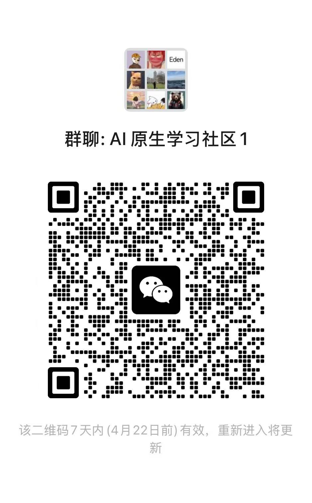
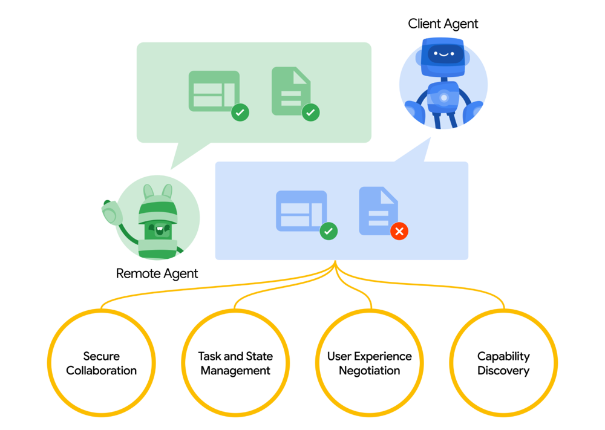

# Google Agent-to-Agent (A2A) 协议详解：打造 Agent 通用通信标准

# Google 的 A2A 协议

## 一、A2A 协议的功能与用途

Google 发起的 A2A（Agent-to-Agent）协议，是一种用于 AI 智能代理之间通信与协作的开放协议。它旨在解决当前不同供应商、平台或技术栈下构建的 AI 代理在协同工作时面临的互通难题。

在企业环境中，AI 代理被广泛部署在客户服务、IT 支持、人力资源、财务等多个业务流程中。然而，这些代理往往由不同开发者实现，接口和行为模式各异，导致跨代理协作难度极高。A2A 协议通过定义标准化通信接口，使这些智能代理可以彼此识别、调用、协作，完成更复杂的业务任务。

A2A 协议不仅支持任务请求与响应，还支持能力发现、会话管理、多轮对话、流式结果传输等多种高级功能，为构建高度自动化和智能化的企业系统提供了关键基础设施。

## 二、技术架构与实现原理

A2A 协议构建在标准的 Web 技术之上，采用 HTTP 作为通信协议，使用 JSON-RPC 2.0 作为消息格式，并通过 Server-Sent Events（SSE）支持服务端实时推送。协议设计理念强调“使用已有标准”，确保易于集成与跨平台支持。

整体架构由 A2A 客户端与 A2A 服务器构成。服务器端代表一个可以接收并处理任务请求的智能代理，客户端可以是另一个代理，也可以是上层应用系统。通过统一的任务模型和消息格式，客户端可以请求代理执行某项任务，并通过轮询或订阅的方式获取执行状态与结果。

代理的基本单元是任务（Task），每个任务包含任务 ID、会话 ID、任务状态、消息历史以及最终结果。任务处理过程中支持异步执行、状态更新、用户补充输入、结果追加等能力，能够支撑长时间、复杂流程的交互。

A2A 的核心包括能力发现（通过 Agent Card）、任务与状态管理、消息与多模态交互（通过 Part 模型）、以及用户体验协商机制。消息的内容可以是文本、结构化数据或文件等，并支持灵活的元数据扩展。

## 三、适用场景与应用范围

A2A 协议广泛适用于多个智能代理协同完成任务的场景，尤其适合在以下领域中使用：

### 企业级业务流程自动化

A2A 可以帮助企业连接部署在不同系统中的多个智能代理，实现人力资源、财务、供应链、客服等模块之间的自动协作。通过 Orchestrator（主控代理）调度其他代理，自动完成一系列业务流程，提升效率。

### 多代理 AI 系统

在 AI 系统研发中，多个专职代理经常被组合用于完成复杂任务。A2A 协议提供统一的交互协议，使不同代理之间可以无缝协作，例如一个检索代理与摘要代理联合完成研究任务。

### 智能平台生态构建

开发者可以通过实现 A2A 协议，使自己的代理或工具加入一个更大的智能代理生态系统。平台可以集成来自多个厂商的代理，只需一个统一接口标准，即可实现扩展与升级。

### 传统系统向智能化过渡

传统 REST API 服务可以通过增加 A2A 接口包装为智能代理，与其他代理交互。这为旧系统提供了一种低成本接入新型 AI 生态的途径。

### 边缘设备与物联网场景

由于 A2A 协议基于轻量级的 HTTP 和 JSON 设计，非常适合在本地或边缘设备上部署，实现本地智能代理之间的高效通信。

## 四、技术组件与协议结构（代码与结构）

### 1. Agent Card

每个代理需要公开一个 `Agent Card`，它是一个结构化的 JSON 文件，声明该代理的能力、接口地址、认证方式等。其他代理或客户端可通过访问标准路径 `/.well-known/agent.json` 来获取这个文件。

Agent Card 包括如下内容：

- 代理名称、描述与版本信息
- 技能（skills）列表，描述支持的任务类型
- 支持的能力（如是否支持流式返回）
- 接口 URL 与认证方式说明

### 2. 核心任务模型（Task）

Task 是代理之间交互的最小单位，每个任务具有唯一 ID 和状态字段。

典型状态包括：

- submitted：任务已提交，等待处理
- working：正在处理
- input-required：需要额外用户输入
- completed：已完成
- failed / canceled：失败或取消

每个任务中包含消息历史（messages）和最终产出（artifacts）。任务支持流式追加产出，也支持会话 ID 用于多轮关联。

### 3. 消息与 Part 结构

每条消息由一个 `role` 和一组 `part` 组成。每个 Part 表示一段内容，可包含不同类型的信息：

- TextPart：纯文本
- DataPart：结构化 JSON 数据
- FilePart：文件、图像、音频等（通过 URI 或 Base64）

通过组合多个 Part，可以实现图文并茂、表单交互、文件传输等复杂内容表达形式。

### 4. 接口方法

A2A 协议定义了一套标准方法，客户端通过 JSON-RPC 协议调用，包括：

- `tasks/send`：发送任务请求
- `tasks/sendSubscribe`：发送任务并订阅流式结果（SSE）
- `tasks/get`：查询任务当前状态
- `tasks/cancel`：取消任务
- `tasks/pushNotification/set`：设置推送回调地址
- `tasks/pushNotification/get`：查询当前任务推送配置

### 5. Server-Sent Events（流式通信）

代理支持以 SSE 方式向客户端推送任务进展与生成内容。事件包括：

- TaskStatusUpdateEvent：任务状态更新
- TaskArtifactUpdateEvent：任务结果产出

客户端可订阅这些事件，实时接收中间结果，实现长任务的交互式跟踪。

### 6. 安全与认证机制

Agent Card 中声明代理所支持的认证方式（如 Bearer Token、API Key）。调用方需根据代理要求附带相应凭证，以保证通信安全。

认证本身在协议之外实现，但 A2A 通过统一接口声明，使接入过程更加规范，便于企业统一管理。