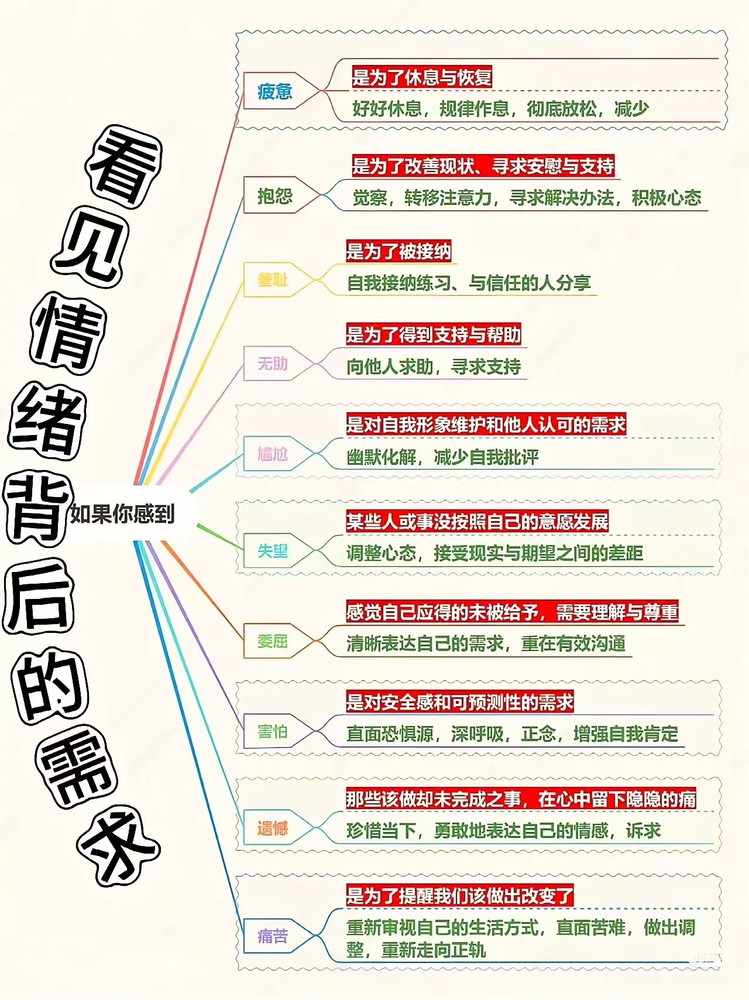

# 如何洞察自己的需求

洞察自己的需求，不仅是与人和 AI 交流的基础，也是与自我和解的必经之路。本文将从多个角度探讨如何更好地理解自己的内在需求。

## 与 AI 交互：提问的艺术始于自我洞察

在与 AI 交互的过程中，我们很快就会发现一个现象：同样是提问，有些人能够获得精准而有价值的回答，而有些人则得到模糊或无关的信息。这种差异往往不在于AI的能力，而在于提问者对自身需求的洞察程度。

当我们面对AI助手时，最常见的误区是提出过于宽泛的问题："给我讲讲关于投资的知识"或"如何提高工作效率"。这类问题背后，往往隐藏着更具体的需求：可能是想了解特定市场的投资策略，或是寻找适合特定工作场景的时间管理方法。

洞察自己的真实需求，意味着我们需要问自己：

- 我真正想解决的问题是什么？
- 我期望获得什么样的信息或帮助？
- 这个问题对我来说为什么重要？

当我们能够清晰地回答这些问题时，我们的提问也会变得更加精准。

这种洞察能力不仅适用于与 AI 的交流，也是我们日常沟通、学习和决策的基础。学会提问，首先要学会理解自己。

## 情绪的解读：需求的信号灯

我们常常被情绪所困扰：莫名的焦虑、突如其来的愤怒、挥之不去的沮丧。这些情绪看似不受控制，实际上却是我们内在需求的信号灯。

当你感到焦虑时，可能是因为安全感的需求没有被满足；
当你感到愤怒时，可能是因为尊重或公平的需求受到了威胁；
当你感到沮丧时，可能是因为成就感或认同感的需求没有得到满足。

马斯洛的需求层次理论告诉我们，人类的需求从生理需求、安全需求、社交需求、尊重需求到自我实现需求，层层递进。而我们的情绪，恰恰是这些需求得到满足或受到挫折时的自然反应。

要了解自己的真实需求，可以尝试以下步骤：

1. **情绪觉察**：当强烈情绪出现时，先不急于行动，而是观察并命名这种情绪。
2. **身体感受**：注意情绪在身体上的表现，如心跳加速、肌肉紧张等。
3. **追问根源**：问自己"为什么会有这种感受？这种情绪背后的需求是什么？"
4. **需求确认**：尝试找出具体的、当下未被满足的需求。

例如，当你因同事的一句话而感到不快时，与其简单地归因于"他态度不好"，不如问问自己："我是否需要被尊重？我是否需要被理解？我是否需要自己的贡献被认可？"

了解自己，从读懂自己的情绪开始。情绪不是敌人，而是指向我们内在需求的指南针。

下图转载自X(@HotmailfromSH)：

# 深度剖析：自我认知的持久修行

洞察自己的需求不是一蹴而就的，而是需要持续的自我剖析和反思。这种能力需要刻意练习和培养，就像锻炼肌肉一样，需要日复一日的坚持。

以下是一些可以帮助你深度剖析自己的方法：

### 1. 定期反思

每天花10-15分钟进行自我反思，可以采用写日记的形式。记录当天的重要事件、自己的情绪反应以及可能的原因。随着时间的推移，你会发现自己的情绪模式和触发点。

### 2. 提问练习

学会向自己提出深度问题：

- 今天什么事让我感到特别高兴/沮丧？为什么？
- 我对某件事的强烈反应，反映了我什么样的价值观或需求？
- 如果可以重来，我会如何处理今天的挑战？
- 我为什么想要学习这个领域，我想从学习这个领域中获得什么？

### 3. 寻求反馈

有时候，我们需要外部的视角来帮助我们看清自己。可以向信任的朋友、家人或专业人士寻求反馈，了解他们眼中的你。当然，你也可以向 AI 来倾诉。

### 4. 尝试冥想

冥想可以帮助我们安静下来，观察自己的思绪而不被它们控制。通过定期冥想，我们能够更客观地看待自己的想法和情绪。

## 结语

洞察自己的需求是一项终身的修行。它始于好奇心和勇气——好奇心让我们愿意探索内心的未知领域，勇气则让我们敢于面对可能的不舒适真相。

从我自身的经验和感受来看，与 AI 交互越多，越是深入地使用 AI 进行学习，越能察觉到自己的需求，越能更好地表达自己的需求。也希望你在 AI 学习的路上，能更好地认识自己的内心！