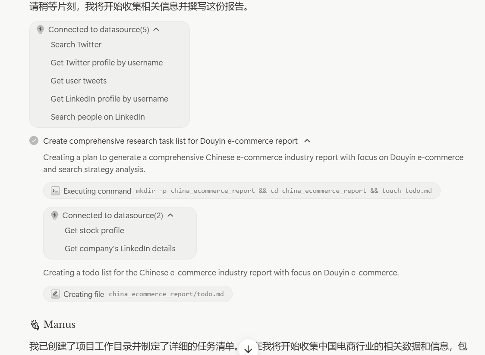
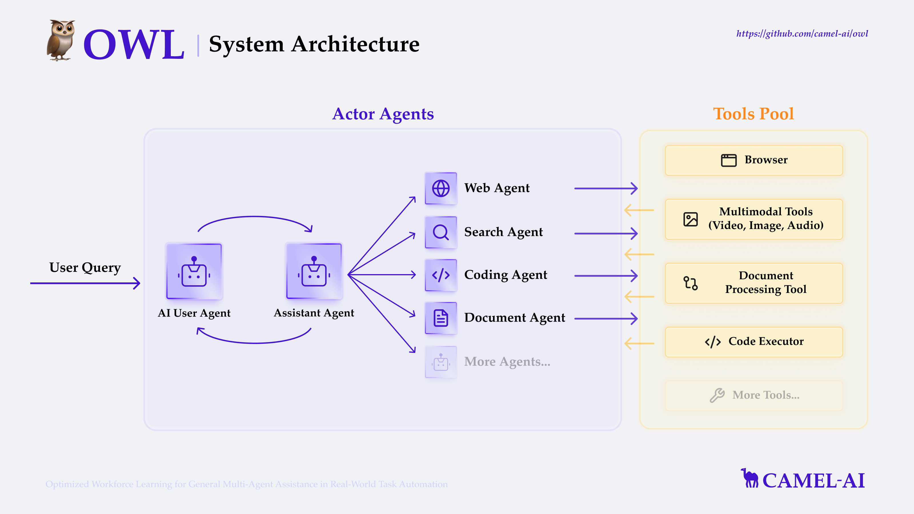

# 深度解析 Manus、Owl、Open Manus


深度解析 Manus、Open Manus、Owl

我记得有个伟人说过，没有调查就没有发言权。开源最大的好处就是可以亲身体验。

独立开发者们可以拿开源框架来学习，但是要让我选一个产品一直用，我还是会选 Manus。

一句话总结：目前这几个开源框架都没必要看，除非有很成熟的产品迭代出来；Manus 可用，但公开上线后有可能定价很贵

## Manus 的爆火现象与理性看待

在 Manus 爆火之前，我了解到圈内部分 KOL 拿到了邀请码准备测试。然而，我并未预料到它会迅速出圈并引发如此广泛的关注，尤其是在采用邀请码机制、大多数人无法体验的情况下。随后，两款开源替代品的快速出现同样获得了大量关注。

我认为，Manus 短时间内获得的巨大关注是把双刃剑，短期来看弊大于利。它面临着严重的"捧杀"风险，特别是一些媒体将其与 DeepSeek 相提并论，这种过度夸大是非常危险的。

客观评价，Manus 在 agent 产品化和用户体验方面确实做得不错，是我亲身体验过之后效果做的最好的通用智能体。但它本质上仍是一个 AI 应用产品，既不需要过度吹捧，也不应无脑贬低。

Manus 在产品化的道路上已经走得很远了，今年将会是 AI 应用集中爆发的一年。难以想象这才是 2025 年的三月份。

# Manus、Open Manus、Owl 综合比较

仅代表发布时的个人感受，里面很多方向都在各个团队的优化日程表上了。

|  | Manus | OpenManus | Owl |
| --- | --- | --- | --- |
| 大众可用性 | ✔️❌（邀请码部分可用） | ✔️（开源） | ✔️（开源） |
| 云端部署 | ✔️ | ❌ | ✔️（docker 部署未测试） |
| 任务规划能力 | 强 | 弱 | 弱 |
| 工具集丰富程度 | 未知（体感上较多） | 较少 | 较多 |
| 底层模型可配置 | ❌ | ✔️（推荐 Open AI） | ✔️（推荐 Open AI） |
| token 消耗 | 高（预估） | 中 | 中 |
| 产品体验 | 高 | 低 | 低 |

下面是我对几个产品的体验总结。解析两个开源框架写的比较长，略显无聊，不想自己本地部署的话，可以跳过详细解析，看下面的总结就够了。

## 总结：

- **Manus 能直接使用，产品化做的最好。**不过邀请码机制难以让大众参与使用。现阶段也没必要求邀请码，除非你有很强烈的装x需求。想要提前体验，可以在官网申请排队，朋友在6号申请的，已经拿到码了
- **Manus 好在，云端部署 + 强任务规划能力 + 强交付能力 + 多 agent 架构；开源框架在任务规划和交付效果上还是有很大差距。**当然，底层模型我用的是 gpt-4o，性能上可能会有差距，所以个人观点仅作参考。
- **小白不建议买码以及折腾本地部署。**意义不大，学习的话直接让 Cursor 分析代码即可。
- **现有开源框架适合学习，不适合直接生产。**产品体验一言难尽，很难解决实际问题，不过更新速度也挺快的。可以看出这几个团队在运营上还是比较给力，趁着热度迅速积累了一批人气，但是确实开源出来有点赶，很多问题没有解决，还是需要进一步迭代。
- Agent 常用工具还是浏览器调用，谷歌搜索，python 脚本编写，文件交互这些。实际上我觉得生产力不如 dify 的专用工作流。 Playwright 这个浏览器操作的框架大家都有在用，我后续会详细分析下。
- 当前我看了几个开源团队的采访，后面迭代上感觉可以试一试用 dify 上好的工作流来做后训练，但可能工程上不太好实现。
- Agent 走向大众的一个问题可能是 token 消耗太多，定价有可能会很贵，参考 devin。
- **制约 Agent 能力主要有两方面，一个是底层模型的能力，这对 agent 开发团队的依赖较少；一个是工程上的规划、组织能力，包括 agent 的行为模式，模型配置，任务分配等。**最终 Agent 将会是开源生态的胜利。尤其是 Agent 目前需要的各种工具集的补齐，开源生态下，工具集的完善速度会快很多，并且更加和真实使用场景贴合。

# 解析 Manus

## **为何 Open Manus 和 Owl 能迅速复刻并开源？**

这个问题的答案与 Manus 的技术原理密切相关。实际上，Manus 的核心技术并非全新发明，而是基于现有技术框架的巧妙整合与优化。

## Manus 工作原理拆解

**Manus 本质上是一个多智能体系统（Multi-Agent），它在一系列基础工具集上实现了协调与规划。**完整的实现细节需要等 Manus 开源后才能进一步分析，但可以从体验和现有信息中推断其基本架构。

AI 通过规划任务来调用工具来解决问题不是个新鲜事，早在 GPT 刚发布时，AutoGPT 就已经能通过调用 Google Search 实现多种功能。而 Anthropic 提出的 MCP 框架进一步赋予了 AI 与外部服务交互的能力。Manus 正是建立在这些 AI 交互工具集的基础之上。也就是说，具备相关开发经验的团队，可以迅速按照这个思路搭一个框架出来，我会在后面讲这两个开源框架的时候详细讲，实际上可以看到他们的思路是类似的。

## Manus 多智能体实现架构

Manus 的工作流程可以概括为：

1. **规划阶段**：首先进行任务分解，形成包含多个子任务的线性结构计划
2. **执行阶段**：按顺序执行每个子任务，并动态分配给相应的专业 Agent
3. **交互循环**：每个 Agent 以 ReAct（Reasoning and Acting）循环的形式调用工具完成任务

简单来说，Manus 会根据你的 prompt 先进行任务规划，比如你说要写一篇关于电商行业的分析报告，他会先进行初步地调研，然后创建一份 todo 清单，这个清单就是 Manus 的工作计划。



比如我们看这个朋友分享的关于编写关于抖音电商研究报告的工作计划，可以看到这个场景下 Manus 规划的主要是信息收集和分析，制定策略建议以及最后来撰写这个报告。


然后 Manus 会将任务分配下去，并且在执行的时候对 to do 工作清单进行更新。完成的任务会标记出来。后面就是任务的具体执行了。

**整个过程理解起来并不复杂，就是 AI 根据你模糊的需求去规划任务，执行任务然后交付结果。**

在实际体验中，我发现 Manus 用户确实强于 Open Manus 和 Owl。这可能是因为 Manus 使用了 Claude 并进行了一系列工程优化。相比之下，Open Manus 和 Owl 虽然支持配置多种模型，但选用不同模型会导致效果差异明显。

**规划能力应该是 Manus 的核心优势之一，任务规划之于 Agent 就像 Prompt 之于大模型的表现。**

## 个人体验感受

我自己是研究员，在我看来，假如我自己要撰写一个研究报告，流程跟 Manus 规划的大致相当。**但是要做一个完整详实的研究报告，将上面的清单全做完，即使在 AI 辅助分析的情况下，也要 2-3 天才能做完，所以这就是 Manus 带来的巨大效率提升。**

这几个环节中节省地最大的应该是搜索和分析环节。**这些传统来说应该是实习生的工作，从这个角度来看，Manus 完全可以替代实习生范围的工作。**

但因为 Manus 没有开源，所以我也不知道他目前的工具集是什么。这些工具集的组合将会是 Manus 执行任务的上限。还有一点就是 Agent 来执行任务的 token 消耗问题，底层模型继续进行迭代，并且降低成本，将会让 Agent 越来越能走向大众。

- 效率提升明显，能替代简单工作
- 云端部署，门槛低，产品化做得不错
- 云端部署还有一个好处就是 7*24 工作，也是产品体验上做的比较好的一点
- 测试不付费，但比较几个开源框架，token 消耗会很高，如果公开上线后定价类似 Devin（500美金每月），则实用性不强。建议 Manus 可以试试只收取框架和机器资源的会员费，然后让用户自己配置 API 消耗 token，这样的定价结构可能更合理，也更容易走向市场
- 目前测下来还是有一些 bug，离达到我心目中正式上线的标准还有距离

# 解析 Open Manus

<aside>
💡

仅代表当前版本的情况。新手小白不建议尝试本地部署，debug 时间将会较长。新手小白其实我更建议从 dify 开始玩起。当然，如果特别感兴趣，那么强烈建议本地部署玩一玩。

</aside>

## Open Manus 本地部署 & 体验实录

- **前置条件：**Cursor（个人习惯）；WSL 插件用于在 Linux 环境里操作；已经配置好 Git（方便拉取更新等）；Open AI API（API 刚需，其他模型 API 也可，但我实操起来问题很多，所以推荐使用 Open AI 的 api）
- 先进入 Open Manus github，照着 readme 先把环境配置好。我使用的是 conda 方法，简单来讲就是方便你切换不同的项目运行环境，相互之间不会互相影响（感兴趣深入了解的可以去深度提问），安装相关的依赖，就是一些工具集，库和包。

[https://github.com/mannaandpoem/OpenManus](https://github.com/mannaandpoem/OpenManus)

- 在我实际的体验里，实际运行总会缺一些需要的环境，这时候让 cursor 去debug，把该装的全装好。感兴趣可以看下下面我在笔记本环境运行的时候，一开始觉得调通了，但其实我笔记本上没有 playwright

[Open Manus 翻车实录1 (1)](https://www.notion.so/Open-Manus-1-1-1b357bfe72818071a3aad7b82ce92039?pvs=21)

- 然后配置好 API 就可以使用了。本地遇到的问题可能千奇百怪，但是最终大概率跟着 Cursor 来 debug 应该能把问题解决，配置 API 强烈建议用 open ai 的，否则问题可能会很多。（Owl 调了一下午，发现还是不行，很多工具把 openai api 写死了）
- 然后我使用 terminal 运行，让他输出了一个 owl 的研究报告，他用了 20 余步进行，期间只使用了google search 和浏览器自动化的 tool。

[Open Manus 记录 (1)](https://www.notion.so/Open-Manus-1-1b357bfe728180b49de8dbe9c6b1bed3?pvs=21)

- 我给他的任务简单来说就是总结下 owl 的代码库并且深度分析。但是一开始用 google search 老是找不到正确页面，所以到后面我直接给他 repo 的url了

总得来说体验没有很好，首先我用的模型是 gpt-4o，在目前是第二梯队的模型，可能模型本身效果不强。然后在本地我遇到几个问题，挑典型的讲一讲：

- 通过 [app.py](http://app.py) 运行，UI 比较粗糙，然后一直报 trminate 错误，failure，所以我就放弃使用 web 交互了
- terminal 交互时，我看日志，上限 step 是 30，playwright 调了许久才能让 open manus 把浏览器调出来，浏览器交互还是有点本我感觉，他一步只能读一个 web 页面的内容，这样很难进行全面的分析
- 然后输出的报告比较简单，不如我用 Cursor 来浏览 repo 输出报告，上面记录里有详细给这个报告。
- tool 调用的挺少的，任务规划也不明确，现在来看不太能投入生产，但开源精神值得鼓励，并且开源框架有助于学习。
- 没有体验到多智能体，也就是多 agent 跑任务，不知道是提示词的问题还是架构本身的问题，还是说我本地机器的问题，我现在体验下来还是单线程一步步做的。虽然我分析了 planning tool 的源文件，但我体验确实是单线程的。

总共消耗了 3 u 的token，实验了五六次，还是比较贵的。优化空间还是非常大的。目前来看解决不了实际生产需求。

## Open Manus 架构

设计上的架构如下图所示：在用户提交需求后，OpenManus 首先调用 PlanningTool 生成一个线性结构的计划，该计划由多个任务组成并被记录到 plan 格式的 markdown 文件中。随后，OpenManus 会逐一查看并提取这些任务，根据任务特性将其分配给最合适的 Agent 执行。这些 Agent 配备了各自特定的工具集，使它们在处理不同类型任务时能发挥各自的优势。


### 目前支持的工具集

下面是完整的工具集，基本上用的多的也就是文件交互（file_saver），浏览器使用（broswer_use_tool）和google 搜索（google search），这也是我实际上跑任务的时候他确实调用过的工具。


# 解析 Owl

## Owl 本地部署 & 体验实录

- 必须要说一下 Owl 团队的执行力和迭代速度，周末配置 Owl，用 claude api bug 一堆，甚至还有 tool 就写死了只能用 Open AI 的 api，但是折腾一天已经无力再去折腾 Open AI 的 api了。不过一个周末代码库已经更新了，还上了 docker 部署，更新速度还是很快的。看好这个团队本身。
- **前置条件：**Cursor（个人习惯）；WSL 插件用于在 Linux 环境里操作；已经配置好 Git（方便拉取更新等）；Open AI API（API 刚需，其他模型 API 也可，但我实操起来问题很多，所以推荐使用 Open AI 的 api）
    
    https://github.com/camel-ai/owl
    
- 克隆owl repo 到本地
- 虽然第一次配 claude 失败了，但我还是买了 open ai 的 api 来测，Owl 的工具集比较多，还支持各种 key 单独配，对于我来说都需要重新购买配置，实属繁琐，所以我就只拿 open ai 的 gpt-4o 来测试了。
- 先试一下他提供的 demo case。代码重构之后需要在源代码里更改 question 来调用，这个设计有点反人类，总之 Owl 还需要再迭代几个版本。

个人觉得 OWL 的提示词写的不错，但架构确实一般。

```markdown
[{'role': 'system', 'content': '\n===== RULES OF USER =====\nNever forget you are a user and I am a assistant. Never flip roles! You will always instruct me. We share a common interest in collaborating to successfully complete a task.\nI must help you to complete a difficult task.\nYou must instruct me based on my expertise and your needs to solve the task step by step. The format of your instruction is: `Instruction: [YOUR INSTRUCTION]`, where "Instruction" describes a sub-task or question.\nYou must give me one instruction at a time.\nI must write a response that appropriately solves the requested instruction.\nYou should instruct me not ask me questions.\n\nPlease note that the task may be very complicated. Do not attempt to solve the task by single step. You must instruct me to find the answer step by step.\nHere are some tips that will help you to give more valuable instructions about our task to me:\n<tips>\n- I have various tools to use, such as search toolkit, web browser simulation toolkit, document relevant toolkit, code execution toolkit, etc. Thus, You must think how human will solve the task step-by-step, and give me instructions just like that. For example, one may first use google search to get some initial information and the target url, then retrieve the content of the url, or do some web browser interaction to find the answer.\n- Although the task is complex, the answer does exist. If you can’t find the answer using the current scheme, try to re-plan and use other ways to find the answer, e.g. using other tools or methods that can achieve similar results.\n- Always remind me to verify my final answer about the overall task. This work can be done by using multiple tools(e.g., screenshots, webpage analysis, etc.), or something else.\n- If I have written code, please remind me to run the code and get the result.\n- Search results typically do not provide precise answers. It is not likely to find the answer directly using search toolkit only, the search query should be concise and focuses on finding sources rather than direct answers, as it always need to use other tools to further process the url, e.g. interact with the webpage, extract webpage content, etc. \n- If the question mentions youtube video, in most cases you have to process the content of the mentioned video.\n- For downloading files, you can either use the web browser simulation toolkit or write codes (for example, the github content can be downloaded via https://raw.githubusercontent.com/...).\n- Flexibly write codes to solve some problems, such as excel relevant tasks.\n</tips>\n\nNow, here is the overall task: <task>Navigate to Amazon.com and identify one product that is attractive to coders. Please provide me with the product name and price. No need to verify your answer.</task>. Never forget our task!\n\nNow you must start to instruct me to solve the task step-by-step. Do not add anything else other than your instruction!\nKeep giving me instructions until you think the task is completed.\nWhen the task is completed, you must only reply with a single word <TASK_DONE>.\nNever say <TASK_DONE> unless my responses have solved your task.\n        '}, {'role': 'user', 'content': '\nNow please give me instructions to solve over overall task step by step. If the task requires some specific knowledge, please instruct me to use tools to complete the task.\n    '}
```

- 这是示例中的任务规划：

```markdown

The task is to search for products on Amazon that are appealing to coders, such as gadgets, accessories, or tools that enhance their coding experience. The goal is to identify these products and provide their names and prices. This involves navigating through Amazon's website, searching for relevant products, and extracting the necessary information.

### Detailed Plan

1. **Access the Website:**
   - Open a web browser and navigate to `https://www.amazon.com`.

2. **Search for Products:**
   - Locate the search bar on the Amazon homepage.
   - Enter keywords that are likely to yield products attractive to coders. Possible keywords include "coding gadgets," "programmer accessories," "developer tools," or "tech gifts for coders."
   - Click the search button or press Enter to initiate the search.

3. **Filter and Sort Results:**
   - Once the search results are displayed, consider applying filters to narrow down the options. Filters could include categories like "Electronics," "Computers & Accessories," or "Office Products."
   - Sort the results by relevance, customer reviews, or price to prioritize the most suitable products.

4. **Review Product Listings:**
   - Browse through the list of products. For each product, note the name and price.
   - Pay attention to products that have high ratings and positive reviews, as these are more likely to be attractive to coders.

5. **Extract Information:**
   - For each product of interest, click on the product listing to view more details.
   - Confirm the product's relevance to coders by reading the description and checking any additional features or specifications.
   - Record the product name and price.

6. **Compile Results:**
   - Create a list of products that are appealing to coders, including their names and prices.
   - Ensure the list is organized and easy to read.

7. **Verify and Finalize:**
   - Double-check the information for accuracy.
   - Make sure the products listed are indeed relevant to the target audience (coders).
```

- 不过我要想进行 google search 的话就需要我自己去配置 google 的 api key，所以这里就不演示别的案例了

# OWL 架构

实际上大体思路和 Manus 是一致的，在他的架构和实际测试中，我也看到他设置的这个提示词。Owl 是一个 role play 模式，User Agent 会 check 交付结果，assistant 会分配任务给不同的 agent 执行。总体上架构没有什么特别好讲的。



# 涌现出这几个框架的实际意义

- Agent 想落地还需要很长时间，不要焦虑，先从 AI 辅助提升自己的学习和工作效率开始。
- 有了 Agent，利好的是有大量相关需求的人，工作效率进一步拉大了，反而普通人可能没有太多能用到 agent 的需求。不过现阶段 agent 能力很弱，不用太担心。
- Manus 能解决工作上实习生 level 的问题，但是token 消耗同样也是惊人的，评估好成本可以尝试投入生产使用，但我对 Manus 的定价不抱期待。
- 独立开发者更加方便了，Manus 这种通用 agent 可以补充很多独立开发者原本的短板，比如市场分析，市场调研这些。我实际上觉得 Manus 写的分析报告比很多券商和大肠市场部写的都要好很多，毕竟券商报告好多也是实习生写的哈哈。
- 单纯的文字工作者和初级的研究员感觉没啥意义了，毕竟研究员本身不生产数据，只是数据的加工商，随着数据源越来越通畅，初级的数据分析，市场梳理这些工作感觉已经被 AI 替代了。毕竟现在的 agent，只要你舍得烧 token，就能 7*24 的搜索市场，分析市场。
- Manus 的爆火至少让通用智能体（ general agent） 这个方向更有关注度了，这对整个生态是大好事，估计很多团队会涌入这个赛道，今年可能会出好多通用智能体。
- 还是需要自己来构建一些工作流的，这个需求依然存在且巨大，所以我下一篇会讲 dify。