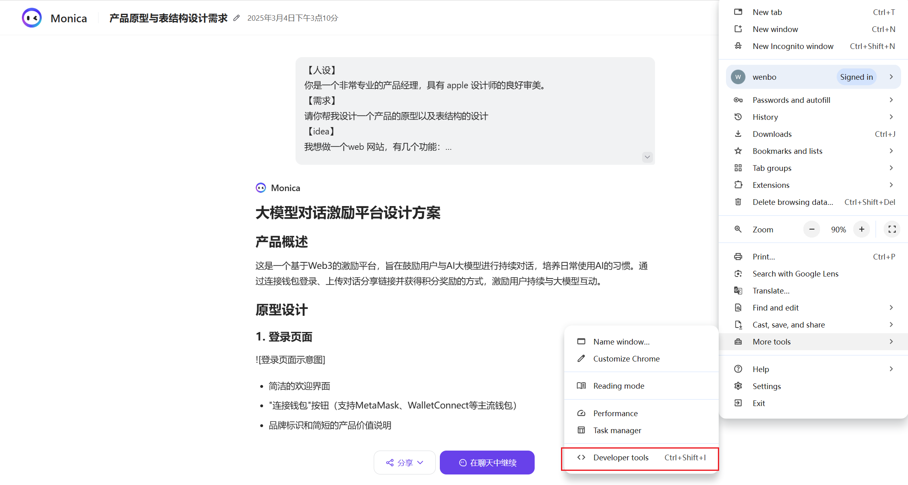

# 翻车实录 1：如何解析 Monica 对话分享链接中的元数据

# 记录 1（2025.3.4）

今天已经做了很多次循环，写这个文章总结一下

基座模型：Claude 3.7 Sonnet

**现在起，跟上节奏！**

我今天想要解决的问题就是，我如果想让用户上传一个大模型对话片段，我是不是可以能够读取，并且分析这里面的内容。

这个问题首先要规定用户上传什么内容，不可能要求用户直接上传原文，md文件或者 json 文件，我看了大多数的对话前端，基本上做的好的，都会允许用户生成一个可直接被外部访问的分享链接。那这样我让用户上传 url ，存到数据库，需要访问内容的时候再直接跑数据分析就可以了。

然后我就尝试了 monica 的链接，最终验证通过链接访问是可行的，这里面尝试了几个方法，首先是直接写一个python 脚本去读，通了，但只返回了页面的 tile。

然后我尝试让 AI 辅助我从浏览器的 developer tool 里去精确定位储存用户对话原内容的地方在哪

我跟着 AI 尝试了很多种方法

因为他一开始定位的几个操作我都不熟悉，所以我直接接去了一些element，network 中的信息，让他看有没有帮助

然后 AI 开始直接指导我在 console 里面运行 js 脚本，列出的情况比较详细，我在执行之后，又返回结果让他去分析。之后给出的分析实际上第一个就定位到了对话数据储存的地方。就是 ai_MonicaService 这个。

我一开始是没有看到的，当时有点想放弃，但是又仔细看了一遍，第一个脚本运行完返回的有 conversation-template 的一个字样，然后我看到了，就开始点进去具体看里面的结构，终于看到了页面对话的内容，然后继续给 AI 分析，终于确定了 Monica 的公开分享链接如何在浏览器本地储存这个链接对应的对话内容了。

最终我确定了Monica 用来在浏览器储存用户对话内容的这个方式，local storage，每一个对话 ID 下面就是对话的详细内容，也记录了相应使用的模型等。

这样起码我可以通过浏览器模拟（很多这种库）来直接访问链接，然后来读取对话内容了。

当然最靠谱的还是可以直接用 api 来访问，但是我目前只是验证如果没办法一起合作，monica 不能出 api 接口的话，我是不是还是可以以某种方式访问到对话数据并进行数据分析。

这个问题解决了之后我就验证了让用户直接上传 URL 是可行的了。

44 页 pdf 已上传 notion，感兴趣看全部对话记录的，请访问 notion 存档。

继续学讲练，AI 编程写代码去了~

[关于读取分享链接内容进行分析的可行性 - Monica AI Chat.pdf](%E5%85%B3%E4%BA%8E%E8%AF%BB%E5%8F%96%E5%88%86%E4%BA%AB%E9%93%BE%E6%8E%A5%E5%86%85%E5%AE%B9%E8%BF%9B%E8%A1%8C%E5%88%86%E6%9E%90%E7%9A%84%E5%8F%AF%E8%A1%8C%E6%80%A7_-_Monica_AI_Chat.pdf)